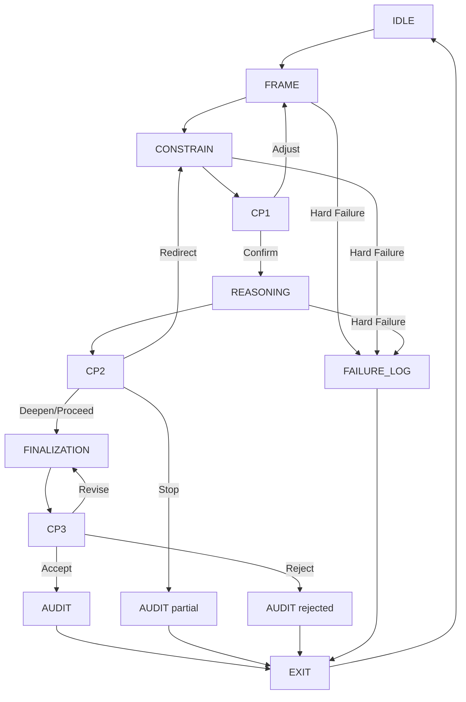
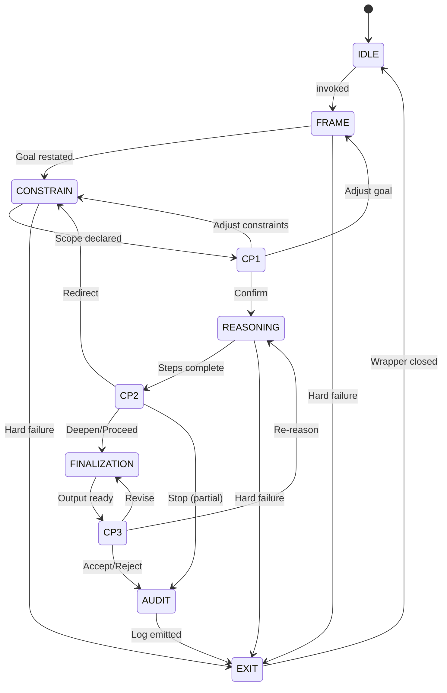

# LMES Diagrams (v1.1)

Diagram source files are defined below as text specifications.
Render using any Mermaid-compatible tool, or commission as graphics.

---

## lmes_architecture

```
Wrapper (outer boundary)
└── Runtime Protocol (inner engine)
    ├── State Machine (IDLE → EXIT)
    ├── Invariants (governance layer)
    │   ├── Reversibility
    │   ├── Lineage
    │   ├── Operator Primacy
    │   └── Non-Obfuscation
    ├── Failure Modes (hard / soft / drift)
    └── Audit Log (evidence layer)
```

---

## runtime_flow (Mermaid source)



---

## runtime_state_machine (Mermaid source)


